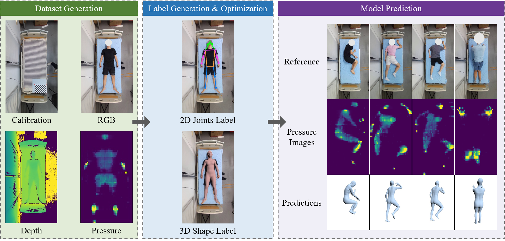
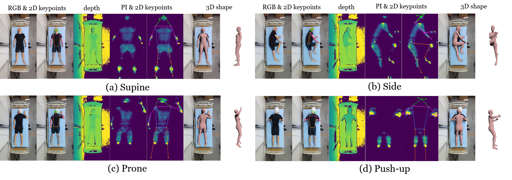
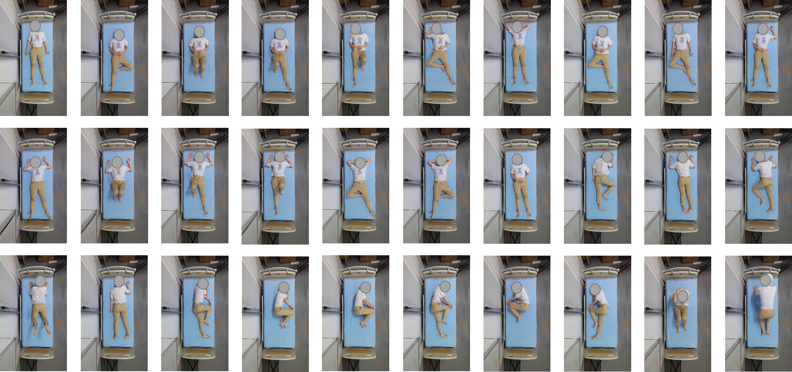
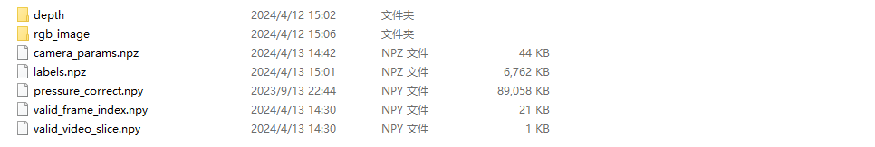
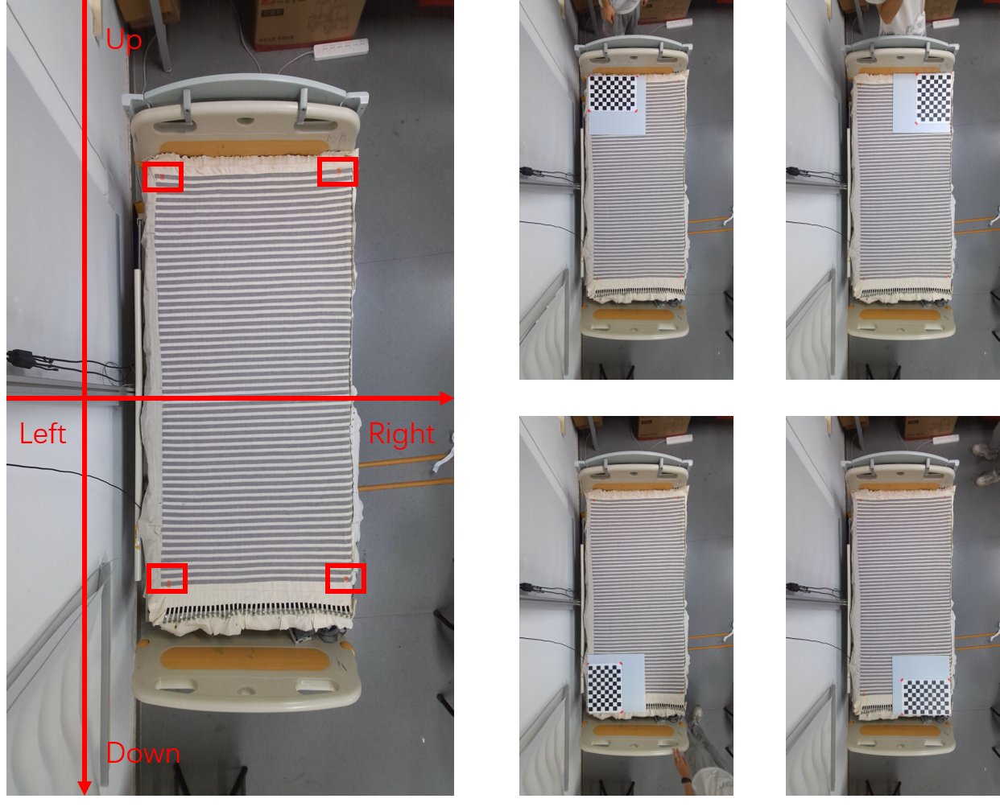

# PIMesh: Video-based In-bed Human Shape Estimation from Pressure Images
Repo for Ubicomp2024 paper: "Seeing through the Tactile: 3D Human Shape Estimation from Temporal In-Bed Pressure Images" 



## Temporal multi-modality In-bed Dataset (TIP)



**Temporal human In-bed Pose dataset (TIP)**: a multi-modality dataset of 152K images from 9 subjects and 40 groups with diverse human representation ground truths (posture, joints, and 3D mesh). The download link is in [Seafile](http://210.45.71.78:8888/d/2eb0988be81b461a85da/).

### Features

* **Three Modalities**:  Pressure, RGB, and depth images.
* **Labels**: including 2D keypoint positions in image and world coordinate systems, 3D human shape labels (in SMPL), posture class, and body attributes.

    * 2D keypoint labels based on COCO17

    * 3D shape labels based on SMPL

    * posture categories including 28 static postures and 2 motions.  

        

        <center>28 static postures (17 supine postures, 7 side postures, and 5 prones) and 2 motions (crunches and push-ups)</center>

    * body attributes including **body weights** and **heights**

        |  Age  | Gender |        | Height (cm) |      |               | Weight (kg) |       |              |
        | :---: | :----: | :----: | :---------: | :--: | :-----------: | :---------: | :---: | :----------: |
        | Range |  Male  | Female |     Max     | Min  |  Mean (std)   |     Max     |  Min  |  Mean (std)  |
        | 22-24 |   4    |   5    |     179     | 152  | 166.17 (7.39) |    75.20    | 38.00 | 55.52 (9,59) |
* **Large-scale**: **152K** three-modality synchronized temporal images from **9** volunteers performing **30** postures in a total of **40** groups.

### Visualization 


### Contents and Attributes

```
Notes: Dictionary posture_index provides the start and end index for each static posture and motion during the whole data sequence in a group. A .xlsx file is given with detailed description of each posture and its corresponding series number in th Index.npy file.
```

The data are organized in experimental groups and `.rar` format (each `.rar` file means a group in the experiment) . In each compressed file, there are:



* `depth`: synchronized collected depth images

* `rgb_image`:  synchronized collected RGB images

* `pressure_correct.npy`: synchronized collected pressure images, organized in (-1, 56, 40) `np.array` format

* `labels.npz`：annotated labels including participant information, postures, 2D keypoints, 3D shape

    * Reading codes

        ```python
        import numpy as np
        
        path = r'1/1/labels.npz'
        data = dict(np.load(path, allow_pickle=True))
        
        # data is a dictionary instance
        
        print(data.keys())
        # dict_keys(['gender', 'height', 'weight', 'label_pose', 'label_betas', 'label_trans', 'keypoints_pix', 'keypoints_pix_smooth', 'keypoints_meter', 'keypoints_meter_smooth', 'posture_index'])
        ```

    * keys

        * `gender`: gender of the current subject.
        * `height`: height.
        * `weight`: body weight.
        * `label_pose`: SMPL pose parameter labels $\theta \in \mathbb{R}^{N \times 72}$ .
        * `label_betas`: SMPL shape parameter labels $\beta \in \mathbb{R}^{N \times 10}.$
        * `label_trans`: root translation labels in the world coordinate system in SMPL $t \in \mathbb{R}^{N \times 3}$.
        * `keypoints_pix`: 2D keypoint labels in the image coordinate system.
        * `keypoints_pix_smooth`: 2D keypoint labels in the image coordinate system after Savitzky-Golay  filters (polyorder as 2 and window size as 7).
        * `keypoints_meter`: 2D keypoint labels in the world coordinate (calculated by camera calibration and perspective transformation).
        * `keypoints_meter_smooth`: 2D keypoint labels in the world coordinate system after Savitzky-Golay  filters (polyorder as 2 and window size as 7).

* `camera_params.npz`: camera calibration parameters and sensor positions in the world coordinate (calibration happens once or twice per day)

    ```
    Note: Taking into consideration the precision of camera calibration and optimization convenience, we have uniformly utilized the camera calibration results from the first day (first 2 subjects) in the optimization and subsequent projection processes, where the camera intrinsic parameters is set at np.array([[941, 0, 0], [0, 941, 0], [536.507773803555, 962.044191934505, 1], [0, 0, 0]]), and the calibration camera-to-bed height is set as 1.66m (which is the closest to the actual scenario).
    ```

    * Reading codes

        ```python
        import numpy as np
        
        path = r'1/1/camera_params.npz'
        data = dict(np.load(path, allow_pickle=True))
        
        # data is a dictionary instance
        
        print(data.keys())
        # dict_keys(['depth_cali', 'depth_bed', 'intParam', 'cali_board_image_position', 'cali_board_world_postion', 'cali_board_bed_corner_shift', 'sensor_number', 'sensor_interval_dis', 'cali_sensor_image_position', 'cali_sensor_position', 'infer_sensor_position', 'bed_left_corner_shift', 'bed_corner_shift'])
        ```

    * keys

        * `depth_cali`: calibrated depth between the camera and the bed plane.
        * `depth_bed`: camera-bed distance got by the depth camera.
        * `intParam`: the intrinsic parameters.
        * `cali_board_image_position`:  We put the calibration board on the corners of the bed plane to get the bed positions in the image coordinate system and thus the world coordinate system (calculated by Matlab). Details are shown in the following Camera Calibration section. `cali_board_image_position` gives the pixel locations of the origins of the calibration board in corners.
        * `cali_board_world_postion`:  the 2D world locations of the origins of the calibration board in corners.
        * `cali_board_bed_corner_shift`: the distance between the board origin and the bed corner. 
        * `sensor_number`: the sensor scale of our pressure-sensing bedsheet ([$56 \times 40$]).
        * `sensor_interval_dis`: sensor pitch ([$0.0311m \times 0.0195m$]).
        * `cali_sensor_image_position`: the pixel positions of the corners of the sensor arrays. (left-down, left-top, right-top, right-down).
        * `cali_sensor_position`: the world positions of the corner of the sensor array calculated by camera parameters.
        * `infer_sensor_position`: inferred corner sensor positions based on the position of left-top unit and the sensor pitch.
        * `bed_left_corner_shift`: distance between the left-down sensor and the camera center.
        * `bed_corner_shift`: Due to the movement of the bed sheet and collision between subjects and the camera, we assume that the rotation angle of the camera remains unchanged, only horizontal displacement occurs. Hence, some data frames were discarded, and the distance between the left-down sensor unit and the camera center was adjusted after the camera shake to ensure the projection accuracy.

* `valid_frame_slice.npy`: Due to the collision between subjects and the camera and the lagging during image storage, some images are discarded in the final dataset. And the the rest of the frame sequences are organized into videos of varying lengths. `valid_frame_slice` records the start and end index of valid sequences~(videos) of the current group. In other words, a continuous experimental record might be divided into numbers of valid sequences in a dataset group.

* `valid_frame_index.npy`: `valid_frame_index.npy` records the valid frame index in the current group.

### Camera Calibration

The sensor corners are marked with red markers (shown in the red rectangles of the following left image) and the bed corners are calibrated with positioned and space-aligned calibration boards (35mm in an A3 paper). We calculated the bed plane and sensor positions based on the calibrated camera parameters and the pixel locations of these captured images. (The depth information is provided by the depth images). **It is worth noting that the arrows in the left figure only indicate spatial direction for descriptive purposes, and their intersections do not signify the position of the coordinate system origin.**



## Reorganized Datasets for PIMesh's Training, Validation, and Testing

Since PIMesh only needs pressure images and their corresponding shape labels, we reorganized the dataset to facilitate PIMesh's training and evaluation. The dataset link is in [PIMesh Dataset](http://210.45.71.78:8888/d/b16e65834409491a970f/). The keys in the data files are the same as TIP as described above.

* the name of `.npz` file is based on the subject and group order.

    ```python
    name_group_map = {
        '1': [1, 6],
        '2': [6, 10],
        '3': [10, 15],
        '4': [15, 21],
        '5': [21, 25],
        '6': [25, 29],
        '7': [29, 33],
        '8': [33, 37],
        '9': [37, 41],
    }
    ```

## Contact

If you have any questions about the paper, code and dataset, please feel free to contact [wzy1999@mail.ustc.edu.cn](mailto:wzy1999@mail.ustc.edu.cn).


